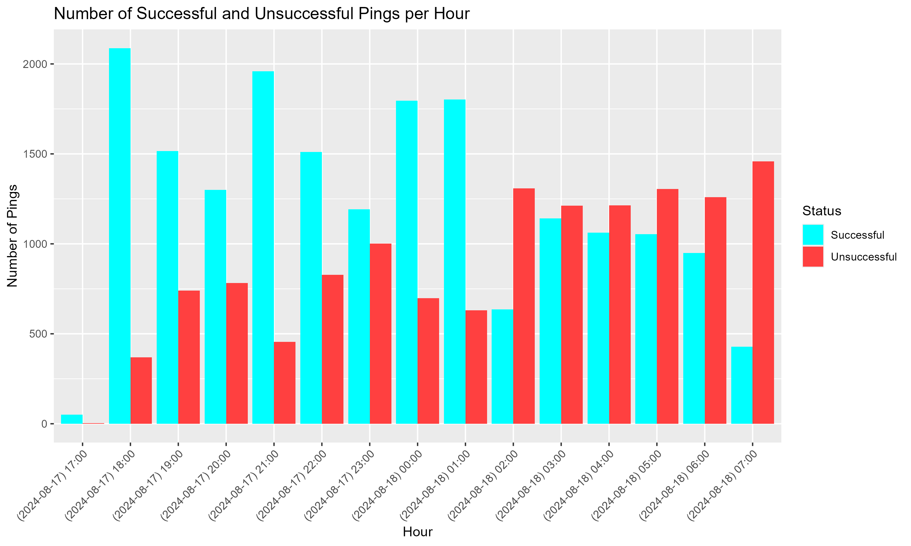

# 🎶 pingeR package

## #️⃣ Indexes
- [Overview](#-overview)
- [Installation](#-installation)
- [Features](#-features)
- [Usage](#-usage)
  - [ping_ip()](#-ping_ip)
  - [start_pinging()](#-start_pinging)
  - [analyze_ping_results()](#-analyze_ping_results)
  - [plot_hour_count()](#-plot_hour_count)
- [License](#-license)
- [Contributing](#-contributing)
- [Contact](#-contact)

## 👓 Overview

pingeR is a R package that helps log, analyze and plot ping results

## 📦 Installation

You can install the development version from GitHub with:
```r
devtools::install_github("aidinghazagh/pingeR")
```

## 🚀 Features

- Run ping attempts to desired IP address for a set amount of time
- Save and log your results in real time into a CSV format
- Find out useful information such as (MIN, MAX, AVG, ...) about the attempts
- Plot, analyze and observe the results from a candle chart

## 📚 Usage
⚠️ REQUIRED --> Run R studio as administrator

### • ping_ip()
```r
dataframe <- ping_ip()
print(dataframe)
# Timestamp PingTime     Status
# 1 2024-08-20 14:30:12      119 Successful
```

### • start_pinging()
```r
destination <- "C:/Users/u/Desktop" # Forward slash
start_pinging(destination, time = 1, ip = "8.8.8.8", feedBack = FALSE, timeUnit = "hours")
```
take a look at the [Results](ping_log.csv)

### • analyze_ping_results()
```r
ping_data <- read.csv("Path to the csv file")
summary <- analyze_ping_results(ping_data)
print(summary)
# $Total_Pings
# [1] 2

# $Successful_Pings
# [1] 2

# $Unsuccessful_Pings
# [1] 0

# $Average_Ping_Time
# [1] 131.5

# $Max_Ping_Time
# [1] 133

# $Min_Ping_Time
# [1] 130
```

### • plot_hour_count()
```r
ping_data <- read.csv("Path to the csv file")
destination <- "C:/Users/u/Desktop" # Forward slash
plot_hour_count(ping_data, destination)
```



➡️ Read the man files inside [man folder](man) for more information about these functions

## 📄 License
This package is licensed under the MIT License. See the [LICENSE](LICENSE) file for details.

## 🤝 Contributing
Contributions are welcome! If you have any ideas or suggestions, feel free to open an issue or create a pull request.

## 📧 Contact
If you have any questions or feedback, feel free to reach out:

Email: [ghazaghaidin@gmail.com](mailto:ghazaghaidin@gmail.com)

Linkedin: [Aidin Ghazagh](https://linkedin.com/in/aidin-ghazagh)
