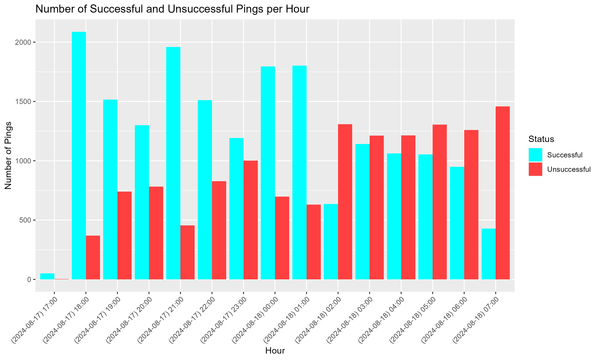

# pingeR package

## Index
- [Overview](#overview)
- [Installation](#installation)
- [Features](#features)
- [Usage](#usage)
  - [ping_ip()](#ping_ip)
  - [ping_multi()](#ping_multi)
  - [start_pinging()](#start_pinging)
  - [analyze_ping_results()](#analyze_ping_results)
  - [analyze_by_window()](#analyze_by_window)
  - [plot_hour_count()](#plot_hour_count)
- [License](#license)
- [Contributing](#contributing)
- [Contact](#contact)

## Overview

pingeR is an R package that helps log, analyze and plot network ping results. Works on Windows, Linux, and macOS.

## Installation

You can install the development version from GitHub with:
```r
devtools::install_github("aidinghazagh/pingeR")
```

## Features

- Ping a single IP or multiple IPs at once
- Cross-platform support (Windows, Linux, macOS)
- Save and log results in real time to CSV
- Configurable ping duration, interval, and time units
- Analyze results with summary stats: min, max, mean, median, p95, p99, packet loss %
- Time-window analysis to observe trends over time
- Plot hourly successful vs unsuccessful ping counts

## Usage

> **Note:** On Windows, run R/RStudio as administrator for ping to work.

### ping_ip()

Ping a single IP address and get the result as a data.frame.

```r
result <- ping_ip("8.8.8.8")
print(result)
#            Timestamp PingTime     Status
# 1 2024-08-20 14:30:12      119 Successful
```

### ping_multi()

Ping multiple IP addresses in one call.

```r
results <- ping_multi(c("8.8.8.8", "1.1.1.1", "4.2.2.4"))
print(results)
#            Timestamp        IP PingTime     Status
# 1 2024-08-20 14:30:12  8.8.8.8      119 Successful
# 2 2024-08-20 14:30:13  1.1.1.1       32 Successful
# 3 2024-08-20 14:30:14  4.2.2.4       45 Successful
```

### start_pinging()

Continuously ping an IP and log results to CSV.

```r
destination <- "C:/Users/Desktop"
start_pinging(destination, time = 1, ip = "8.8.8.8", feedback = FALSE, timeUnit = "hours")
```

Additional parameters:
- `interval` — seconds between pings (default: 1)

```r
# Ping every 5 seconds for 30 minutes
start_pinging(destination, time = 30, ip = "8.8.8.8", timeUnit = "mins", interval = 5)
```

Take a look at the [Results](ping_log.csv).

### analyze_ping_results()

Analyze a ping log data.frame and get summary statistics.

```r
ping_data <- read.csv("ping_log.csv")
summary <- analyze_ping_results(ping_data)
print(summary)
# $Total_Pings
# [1] 100
#
# $Successful_Pings
# [1] 97
#
# $Unsuccessful_Pings
# [1] 3
#
# $Packet_Loss_Percent
# [1] 3
#
# $Average_Ping_Time
# [1] 45.2
#
# $Median_Ping_Time
# [1] 42
#
# $P95_Ping_Time
# [1] 89
#
# $P99_Ping_Time
# [1] 120
#
# $Max_Ping_Time
# [1] 133
#
# $Min_Ping_Time
# [1] 28
```

### analyze_by_window()

Group ping data into time windows and compute per-window statistics. Useful for spotting trends.

```r
ping_data <- read.csv("ping_log.csv")
windowed <- analyze_by_window(ping_data, window_mins = 30)
print(windowed)
#           Window_Start Ping_Count Mean_Ping Median_Ping P95_Ping Packet_Loss_Percent
# 1 2024-08-20 14:00:00         50      44.1          42       85                   2
# 2 2024-08-20 14:30:00         50      46.3          44       92                   4
```

### plot_hour_count()

Plot a bar chart of successful vs unsuccessful pings per hour.

```r
ping_data <- read.csv("ping_log.csv")
destination <- "C:/Users/Desktop"
plot_hour_count(ping_data, destination)
```



Read the man files inside the [man folder](man) for more information about these functions.

## License
This package is licensed under the MIT License. See the [LICENSE](LICENSE) file for details.

## Contributing
Contributions are welcome! If you have any ideas or suggestions, feel free to open an issue or create a pull request.

## Contact
If you have any questions or feedback, feel free to reach out:

Email: [ghazaghaidin@gmail.com](mailto:ghazaghaidin@gmail.com)

Linkedin: [Aidin Ghazagh](https://linkedin.com/in/aidin-ghazagh)
